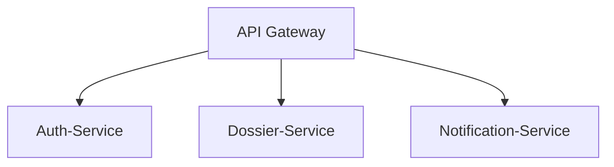
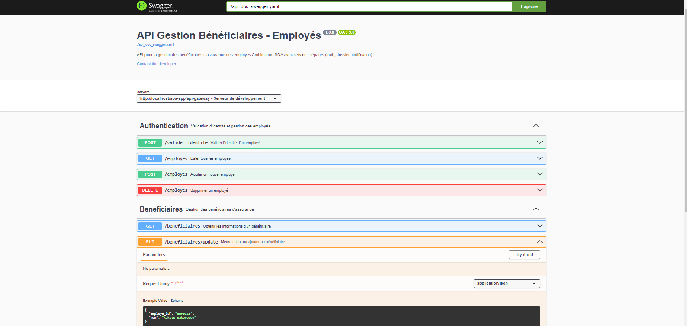

# 🏢 Gestion des Bénéficiaires d'Assurance - Architecture SOA

 


Application pour la gestion des bénéficiaires d'assurance-vie des employés selon une architecture orientée services (SOA).

## 📋 Fonctionnalités

- **Validation d'identité** des employés
- **Gestion des bénéficiaires** (ajout/modification)
- **Notifications automatiques** par email (pref. gmail)
- **API RESTful** documentée avec Swagger

## 🏗 Architecture des Services



| Service               | Description                          | Endpoints                          |
|-----------------------|--------------------------------------|------------------------------------|
| **Auth-Service**      | Validation des identités employés    | `POST /valider-identite`          |
| **Dossier-Service**   | Gestion des bénéficiaires           | `PUT /beneficiaires/update`       |
| **Notification**      | Envoi d'emails                      | `POST /envoyer-mail`              |

## 🚀 Flux Principal

1. **Identification**  
   ```http
   POST /valider-identite
   ```
   ```json
   {
     "nom": "Diary Kely",
     "numero_employe": "EMP0123",
     "adresse": "123, ENI Tanambao",
     "nas": "123-456"
   }
   ```

2. **Mise à jour bénéficiaire**  
   ```http
   PUT /beneficiaires/update
   ```
   ```json
   {
     "employe_id": "EMP0123",
     "nom": "Marie Joseph"
   }
   ```

3. **Notifications automatiques**  
   - Email de confirmation à l'employé
   - Avis à la compagnie d'assurance

## 📚 Documentation API

Documentation Swagger complète disponible :  
[](api_doc_swagger.yaml)

**Capture d'écran :**  


## ⚙️ Installation

```bash
# 1. Cloner le dépôt
git clone https://github.com/diary-git/soa-app_repo.git

# 2. Installer les dépendances
composer install

# 3. Configurer les bases de données
cp config/db_xxxx.php db_xxxx.php
```

## 📦 Prérequis

- PHP 7.4+
- MySQL 5.7+
- Composer
- Serveur web (Apache/Nginx)

## 🚀 Endpoints Clés (autre endpoints sur le Swagger)

| Méthode | Endpoint                | Description                                  |
|---------|-------------------------|----------------------------------------------|
| `POST`  | `/valider-identite`     | Validation identité employé                  |
| `PUT`   | `/beneficiaires/update` | Modification bénéficiaire                    |
| `GET`   | `/beneficiaires`        | Consultation bénéficiaire                    |

## 📄 License

MIT © - PROJECT SOA & BPM - ENI MAI 2025
```